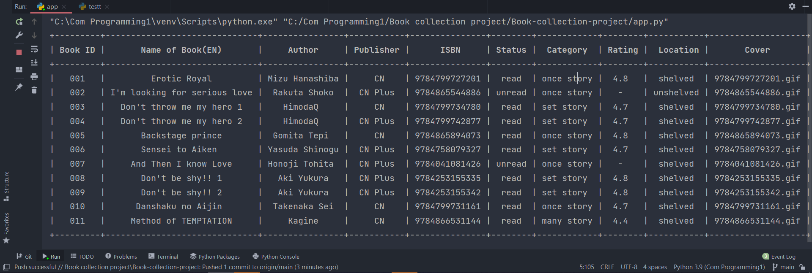

# Book Collection Project

---
The main objectives of this project is for conclude and apply 
all lesson in the 01219114 Computer Programming I course and another 
objective is for creating program that can help user to store, find 
and manage the data of his/her book collection.

## Overview and features

---

This application is used for manage everything about book collection data. 
And this all of features in my application.

###  Add a new book
user can add new book into database.
* program will generate their own book ID automatically.
* user can check all details and book's cover before store it in database.
     
    
     
###  Find a book
user can find book from database.
* user can find book by _4 details_ that are 
  * Book ID
  * NameTH
  * NameEN
  * ISBN
* app will show all details and book's cover on screen.

    

###  Filter book
user can filter book from database.
   * user can filter book by 8 details that are
      - NameEN
      - Author
      - Publisher
      - Status
      - Category
      - Rating
      - Location
      - Cover
   * app will show all filtered book in form of table on console.
  
        

###  Update book's details
user can update book's detail in database.
   * have 2 features that user can use to update are
      - update whole book : used to update all details in 
        that book but still use original ID
      - update specific detail : used to update specific detail, 
        and the detail that can update are
        - Status
        - Rating
        - Location
        - Cover

     

###  Show all books
app will show all book in collection in form of table on console.
  

  
###  Quit menu
mostly step in app allow user to press q to quit 
and back to menu or to exit program.

###  Change theme
user can run and choose theme in `app.py` to change 
theme in application. the theme that available now are
* Default theme
* Dark theme
* Mono theme
* Peach theme
* Winter theme
* Yaoi theme
    

##  Program's Requirement 
***
These are required python version,modules and tools 
that need to download before running the program.

###  Python version
* [Python 3.9](https://www.python.org/downloads/)
###  Modules
look at all module that need to download in `requirements.txt`.
* `turtle` : use for all graphic.
* `prettytable` : use for create and print table on console.
* `time` : use sleep function to delay some graphic.
* `os` : use for access picture file in each folder.
* `json` : use json file to store data.

Note : font `Consolas` is required for better experience, 
click [here](https://github.com/tsenart/sight/raw/master/fonts/Consolas.ttf) to download.

## Program's design 
***
My application consists of 3 main classes that are 
`Book`, `BookDB` and `Display`. and have 2 classes are 
ConsoleColor and ScreenColor for decorate the program.

###  Class `Book` 
This class is used to represent a book and each book will have
their own details which was used to create attributes.
In addition, each book will have their own ID that was created
automatically.
###  Class `BookDB`
This class is used to manage all about data file in this app.
and have two attributes that are
###  Class `Display`
This class is used to display all the features on Python Turtle
Graphic screen and show the table of data on console.
###  Class `ConsoleColor` and `ScreenColor`
This 2 class are use for decorating color,format and theme in application.

###  UML class diagram 

## Code structure 
***
This program consists of 5 python files for running program. 2 database
files that are a json file and a txt file. And 3 folder of picture.
###  Python file
* `app.py ` : This file is used for **running program** and enter to the application.
* `book.py `: This file is used for contain **Book** class.
* `bookdatabase.py` : This file is used for contain **BookDB** class.
* `display.py` : This file is used for contain **Display** class.
* `color.py` : This file is used for contain **ScreenColor** and **ConsoleColor** class.
###  Database file
* `bookdatabase.json` : This is an example json file that contain all data of all books
  in collection.
* `fileID.txt` : This is an example txt file that contain all ID of book that
  used to running ID in each book.
###  Picture folder
* `cover folder` : This folder is used to store all of book's cover picture.
* `pointer folder` : This folder is used to store all of pointer picture that
  used for decorate theme app.
* `picture folder` : This folder is used to store all of decorated picture

---
 ### **Hope you got a great experience, Thank you **

---   
